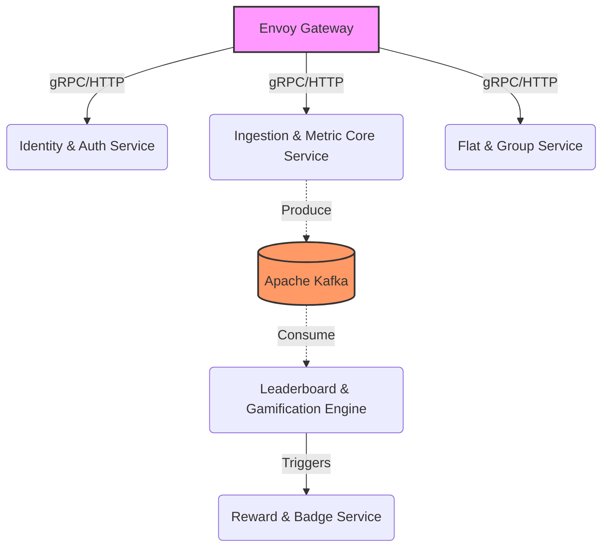
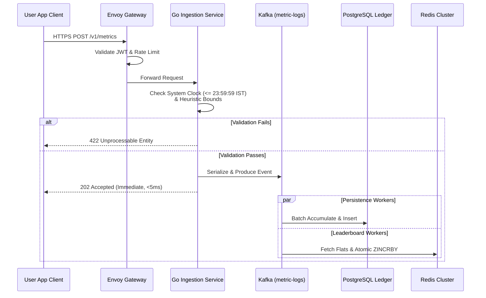
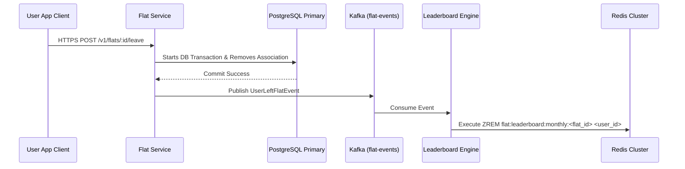
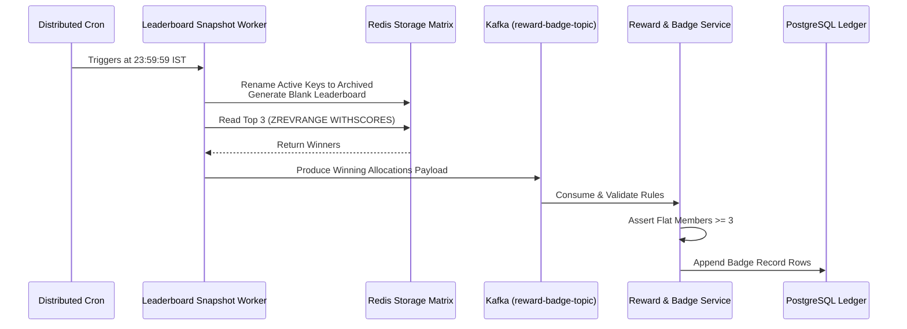

# High-Level Design (HLD) Documentation — Flatfit

**Project Name:** Flatfit  
**Target Scale:** 100,000+ Daily Active Users (DAU)  
**System Clock Baseline:** Indian Standard Time (IST, UTC+5:30)  
**License Paradigm:** 100% Free and Open-Source Software (FOSS)  

---

## 1. System Architecture Overview

Flatfit relies on a highly scalable, decoupled, event-driven architecture designed to manage sudden traffic surges near midnight IST. To ensure that high-volume tracking updates do not slow down client requests, the core ingestion engine is separated from persistent storage by a distributed messaging buffer.

The entire ecosystem is built with open-source technologies, avoiding proprietary cloud services to prevent vendor lock-in.

### Architectural Core Layers

1. **Perimeter Layer:**
   * **Envoy Proxy / Kong Gateway (OSS):** Functions as the reverse proxy and entry gate. It handles TLS termination, global rate-limiting via a Redis bucket plugin, JWT signature verification, and client version validation.
2. **Compute Layer (Microservices):**
   * **Go (Golang) Services:** Stateless, highly concurrent microservices running inside container environments. Go's lightweight runtime handles thousands of concurrent HTTP requests efficiently using minimal CPU and memory footprints.
3. **Buffering & Streaming Layer:**
   * **Apache Kafka (OSS Community Edition):** Acts as the primary message broker. It partitions incoming tracking metrics on disk instantly, ensuring zero data loss during high-volume periods and isolating backend databases from direct peak traffic loads.
4. **Caching & Real-Time Aggregation Layer:**
   * **Redis (OSS Engine) / KeyDB:** Manages active application states, user sessions, temporary streak configurations, and real-time leaderboards using **Redis Sorted Sets (ZSET)**.
5. **Relational Storage Layer:**
   * **PostgreSQL (OSS):** Serves as the immutable system ledger. It maintains ACID-compliant relational data across User Accounts, Flat Profiles, Membership configurations, and verified daily tracking summaries. Configured with a dedicated write-primary and multiple async read-replicas managed by a **PgBouncer** connection proxy.

---

## 2. Microservice Boundaries & Domain Responsibilities

To preserve absolute domain isolation, the system is decomposed into five core microservices. Each service communicates asynchronously through Kafka for state propagation and synchronously via internal gRPC channels for transactional dependencies.

### 2.1 Identity & Authentication Service
* **Responsibilities:** Manages user registration, login, logout, password resets, and session management.
* **Storage Interactivity:** Reads/writes credentials to the PostgreSQL primary cluster; reads from Redis to check token revocation lists.
* **Cryptographic Protocol:** Employs `Argon2id` for password hashing. Generates short-lived JWT access tokens (15 minutes) and long-lived opaque refresh tokens stored securely in Redis.

### 2.2 Ingestion & Metric Core Service
* **Responsibilities:** Exposes high-throughput write endpoints for logging manual metrics. Enforces the strict *Today-Only Mutability Law* relative to midnight IST.
* **Storage Interactivity:** Does not write directly to databases during ingestion. Instead, it validates inputs synchronously against metadata parameters and serializes valid payloads onto Kafka topics.

### 2.3 Flat & Group Service
* **Responsibilities:** Manages the life cycle of user-created groups ("Flats"). Handles member invitations, join requests, permissions, and exit flows. Enforces the minimum requirement of $\ge 3$ active members before a Flat becomes eligible for monthly leaderboard badge distributions.
* **Storage Interactivity:** Directly handles PostgreSQL transaction structures to add or remove user-to-flat relational mapping records.

### 2.4 Leaderboard & Gamification Engine
* **Responsibilities:** Processes streaming scoring events from Kafka. Coordinates multi-destination leaderboard updates across Global and Flat boundaries. Manages streak histories, calculations, and updates.
* **Storage Interactivity:** Maintains active point spaces using memory-mapped Redis Sorted Sets.

### 2.5 Reward & Badge Service
* **Responsibilities:** Evaluates completed historical periods and handles badge assignments. Contains a rule engine that monitors point states, streak patterns, and win categories to distribute digital badges on profiles.
* **Storage Interactivity:** Writes badge award rows to PostgreSQL and updates profile achievement caches in Redis.

---

## 3. Core Data Flow Topologies

### 3.1 End-to-End Metric Ingestion Flow
This flow shows the path a metric submission takes, from the user's interface through edge validation, ingestion buffering, and asynchronous persistence.

#### Detailed Flow Mechanics:
1. The client sends a metric payload (e.g., `{"metric_type": "water", "value": 3, "timestamp": 1782753200}`) to `/v1/metrics`.
2. **Envoy Gateway** verifies the user's identity via JWT and confirms the API request fits within safe rate limits.
3. The **Go Ingestion Service** acts as an edge guardian:
   * It checks the backend server clock to ensure the submission is within the current IST day. If the clock has reached `00:00:00 IST`, the previous day is locked, and the write is rejected with an HTTP `422` error.
   * It checks numeric bounds to block clearly spoofed values.
4. If validation passes, the service publishes a serialized event to Kafka's `metric-logs-topic` and returns an immediate `202 Accepted` status to the client app.
5. Downstream Consumer Groups pull messages from the topic concurrently:
   * **Persistence Consumer Group:** Groups multiple metric records into optimal batches and saves them to **PostgreSQL**, keeping an audit trail of user activities.
   * **Leaderboard Consumer Group:** Reads user profiles to identify their current active Flats and runs parallel `ZINCRBY` updates against the Global and Flat leaderboard keys inside **Redis**.

---

### 3.2 Mid-Month Flat Exodus Flow
This flow handles the immediate point removal required when a user leaves a Flat group.

#### Detailed Flow Mechanics:
1. The user clicks "Leave Flat". The client application sends an authenticated request to the Flat Service.
2. The **Flat Service** handles the removal within a standard PostgreSQL database transaction to safely update membership mappings.
3. Once committed, the service publishes a `UserLeftFlatEvent` message onto the `flat-events-topic` in Kafka.
4. The **Leaderboard Engine** processes this event, reads the `flat_id` and `user_id` coordinates, and runs a direct `ZREM` query against the target Redis Sorted Set. This instantly wipes the user's records from that Flat's leaderboard cache.

---

### 3.3 Midnight IST Tournament Closure & Snapshot Flow
This flow details the atomic snapshotting engine that runs exactly at 23:59:59 IST to lock tournament historical results.

#### Detailed Flow Mechanics:
1. A distributed orchestration engine triggers the snapshot process exactly at `23:59:59 IST`.
2. The **Snapshot Worker** interacts directly with Redis to freeze active ranking keys via atomic commands (`RENAME`), shifting the current leaderboard to an archival namespace and opening a fresh scoring index for the upcoming day/week/month.
3. The worker queries the frozen archive using `ZREVRANGE` to grab the top 3 high scores.
4. It packages these standings into a message and publishes it to Kafka's `reward-badge-topic`.
5. The **Reward & Badge Service** consumes the standings payload, cross-checks the target Flat’s total member size via PostgreSQL read-replicas, and verifies the group contains $\ge 3$ members. If it qualifies, it inserts permanent badge entries for the top 3 winners into the PostgreSQL ledger.

---

## 4. Storage Architecture & Cache Strategy

To prevent relational databases from crashing under peak traffic loads, the system uses memory-mapped Redis caches to serve real-time reads and load-balancing message queues to regulate transactional writes.

### 4.1 Relational Schema Strategy (PostgreSQL)
The primary database maintains the core system records. All tables use UUIDv4 for identification to allow horizontal database partitioning (sharding) in the future.

* **Core Tables:**
  * `users`: Identity credentials, metadata profile text, security details, and registration logs.
  * `metrics_ledger`: Raw daily manual log histories. Built as a time-bucketed ledger using append-only configurations.
  * `flats`: Group profiles, creator IDs, verification status, and invite tokens.
  * `flat_memberships`: Join dates, roles, and structural parameters mapping users to flats.
  * `issued_badges`: Immutable history log tracking earned achievements and leaderboard placements.

### 4.2 Cache Mapping Strategy (Redis Sorted Sets)
Leaderboard indexes are managed directly within Redis Sorted Sets (ZSETs), using 64-bit floating-point values to handle real-time calculations efficiently.

* **Key Layout Strategies:**
  * Global Leaderboard: `leaderboard:global:{period}:{date_string}`
  * Flat Leaderboards: `leaderboard:flat:{flat_id}:{period}:{date_string}`
  * *Where `{period}` matches `daily`, `weekly`, or `monthly` indices.*

* **Algorithmic Complexities:**
  * **Updating a Score:** `ZINCRBY key increment member` — Runs at $O(\log N)$ time complexity. Updates positions instantly even when processing millions of users.
  * **Querying a Leaderboard Screen:** `ZREVRANGE key start stop WITHSCORES` — Runs at $O(\log N + M)$ complexity (where $M$ is the number of requested rows, typically 20 to 100). This provides lightning-fast UI responses.

---

## 5. Non-Functional Requirements & Resiliency Profiles

### 5.1 Security Profile & Threat Mitigation
* **Input Bounds Validation:** The Go Ingestion Service applies strict heuristic boundary filters to incoming manual data forms. Submissions attempting to pass unrealistic numbers (e.g., logging 50 hours of sleep or 80 liters of water) are blocked at the perimeter to maintain leaderboard integrity.
* **Device Signature Verification:** API calls require client applications to pass cryptographic device fingerprint headers (`X-Device-Signature`). This allows the gateway to verify session origins and block scripted bot nets from spamming manual metric updates on multiple dummy accounts.

### 5.2 Scalability & The Midnight Ingestion Buffer
* **Decoupled Architecture:** Using Kafka prevents database degradation during the late-night traffic rush. When users flood the app with metrics right before midnight, the Go services append the payloads to Kafka within milliseconds and return a fast response to the client. The database writes run safely in the background, consuming the queue at a steady, manageable pace.

### 5.3 High Availability & Data Durability
* **Kafka Replication Factor:** All topics are deployed with a replication factor of 3 across distinct infrastructure zones, ensuring zero data loss if an individual broker fails.
* **PostgreSQL Backup Schedule:** Continuous archiving using Write-Ahead Logging (WAL) paired with daily automated logical snapshot routines provides point-in-time recovery capabilities to defend against data corruption.

---

## 6. System Trace Matrices

### 6.1 Standard Path Matrix: Logging a Daily Metric
* **App Ingestion Entry:** Client pushes metric data $\rightarrow$ Envoy Proxy verifies authorization tokens.
* **Validation Check:** Go Ingestion Service verifies that the system clock is $\le \text{23:59:59 IST}$.
* **Stream Buffer Hop:** Event is appended to Kafka $\rightarrow$ Client receives a fast `202 Accepted` response.
* **Downstream Write Sync:** Persistence workers save the record to PostgreSQL, while Leaderboard workers run concurrent score updates across the active Redis sets.

### 6.2 Error Path Matrix: Handling Late-Night Ingestion Delays
* **Scenario:** Heavy network lag delays a metric submitted at 23:58:00 IST, so it doesn't reach the backend workers until 00:00:05 IST.
* **Resolution:** Ingestion services stamp every incoming message with an unalterable server timestamp (`ingested_at_ist`) upon arrival. Downstream workers evaluate this original timestamp rather than the current processing time. Seeing it belongs to the previous day, it directs the score update to the corresponding historical leaderboard index rather than the active one, keeping streaks and closed tournament rankings accurate.